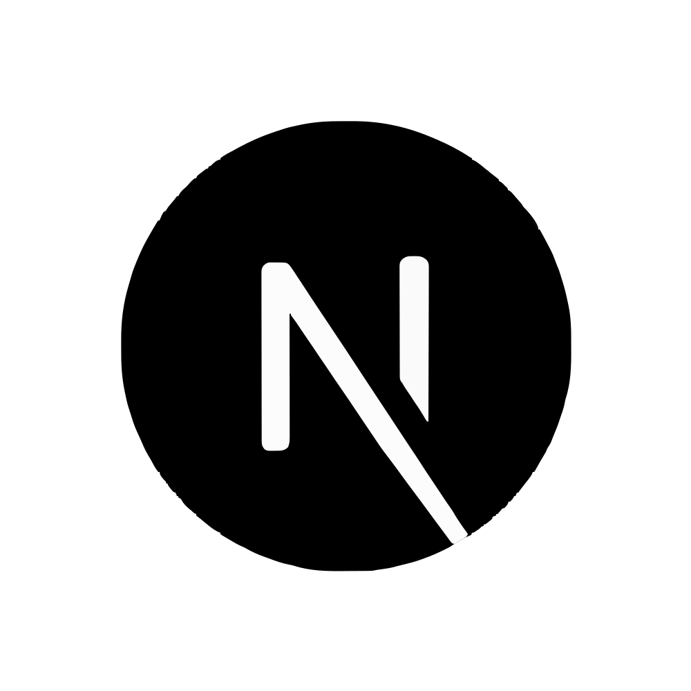

## Hi there, I'm Nurdian Aprilianto👋

I'm a **Fullstack Developer** with a passion for creating dynamic web applications using a variety of modern technologies. I specialize in both frontend and backend development, and I love bringing designs to life while ensuring efficient, scalable back-end architectures.

  
  

   

  
  
   

---

<!--  -->
<!--  -->

## Technology Stack that I use :

### Frontend

  
  
  
  
  
  
  
  

### Backend

  
  

### Database

  
  

### Tools

  
  
  
  
  
  
  

---

<!--
**Maniexie/Maniexie** is a ✨ _special_ ✨ repository because its `README.md` (this file) appears on your GitHub profile.

Here are some ideas to get you started:

- 🔭 I’m currently working on ...
<!-- - 👯 I’m looking to collaborate on ...
- 🤔 I’m looking for help with ...
- 💬 Ask me about ...
- 📫 How to reach me: ...
- 😄 Pronouns: ...
- ⚡ Fun fact: ...
-->

 <!-- 🌱 I’m currently learning ... -->
